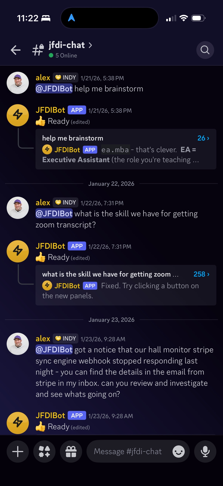
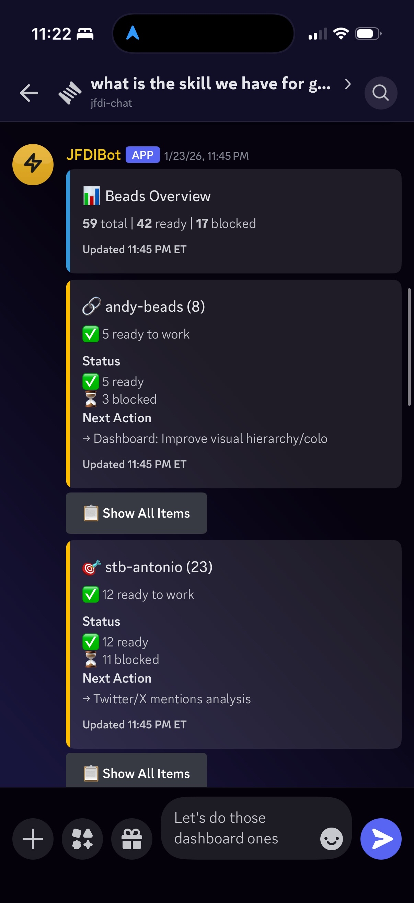

# Cord

A Discord harness for Claude Code. Thread-based conversations, interactive elements, works anywhere you already run Claude.

> **cord** /kôrd/ — a connection between two things.

[](https://www.npmjs.com/package/cord-bot)

<p align="center">
  
  
</p>

Uses Discord threads for individual Claude Code sessions. No exposed ports — runs outbound over the Discord bot API. Works with your Max plan on any machine that can run Claude Code CLI.

## What You Get

- **Thread-based sessions** — Each @mention spawns a Claude Code session in its own thread with full context preserved
- **Rich interactions** — Embeds, buttons, file attachments, status tracking
- **Status visibility** — See "Processing → Done" right in the channel without opening threads
- **Claude Code skill** — Teaches your assistant the commands. No MCP server needed.

## Quick Start

```bash
# Create a new Cord project
bunx create-cord my-bot
cd my-bot

# Start Redis (if not already running)
redis-server &

# Start Cord
cord start
```

<details>
<summary>Alternative: Clone from GitHub</summary>

```bash
git clone https://github.com/alexknowshtml/cord.git my-bot
cd my-bot
bun install
cord setup
cord start
```
</details>

## Prerequisites

- [Bun](https://bun.sh) runtime
- [Redis](https://redis.io) server
- [Claude Code CLI](https://claude.ai/code) installed and authenticated
- Discord bot token (see setup below)

## Discord Bot Setup

1. Go to [Discord Developer Portal](https://discord.com/developers/applications)
2. Click **New Application**, give it a name
3. Go to **Bot** tab → Click **Add Bot**
4. Under **Privileged Gateway Intents**, enable:
   - **Message Content Intent** (required to read message text)
5. Click **Reset Token** → Copy the token (this is your `DISCORD_BOT_TOKEN`)
6. Go to **OAuth2** → **URL Generator**:
   - Scopes: `bot`
   - Bot Permissions: `Send Messages`, `Create Public Threads`, `Send Messages in Threads`, `Read Message History`, `Add Reactions`
7. Copy the generated URL → Open in browser → Invite bot to your server

**Note:** This runs 100% locally. The bot connects *outbound* to Discord's gateway - no need to expose ports or use ngrok.

## Architecture

```
Discord Bot  →  BullMQ Queue  →  Claude Spawner
 (Node.js)       (Redis)          (Bun)
```

- **Bot** (`src/bot.ts`): Catches @mentions, creates threads, sends to queue
- **Queue** (`src/queue.ts`): BullMQ job queue for reliable processing
- **Worker** (`src/worker.ts`): Pulls jobs, spawns Claude, posts responses
- **Spawner** (`src/spawner.ts`): The Claude CLI integration (the core)
- **DB** (`src/db.ts`): SQLite for thread→session mapping

## Working Directory Configuration

Cord supports per-channel working directories so Claude operates in the correct project context.

**Channel-level configuration** (persists for all conversations in that channel):
```
/cord config dir ~/Code/myproject
```

**Per-message override** (one-time, just for this conversation):
```
@bot [/other/project] what files are here?
```

**Fallback chain**: Thread override → Channel config → `CLAUDE_WORKING_DIR` env → `process.cwd()`

### Security: Directory Allowlist

For multi-user deployments, restrict which directories users can access:

```bash
CORD_ALLOWED_DIRS=/home/projects,/var/code
```

If not set, any existing directory is allowed (backward compatible). When set, paths outside the allowlist are rejected.

## Environment Variables

| Variable | Required | Default | Description |
|----------|----------|---------|-------------|
| `DISCORD_BOT_TOKEN` | Yes | - | Your Discord bot token |
| `REDIS_HOST` | No | `localhost` | Redis server host |
| `REDIS_PORT` | No | `6379` | Redis server port |
| `CLAUDE_WORKING_DIR` | No | `cwd` | Default working directory for Claude |
| `CORD_ALLOWED_DIRS` | No | - | Comma-separated allowlist of directories (security) |
| `DB_PATH` | No | `./data/threads.db` | SQLite database path |

## CLI Commands

Once running, Cord provides CLI commands for interacting with Discord:

```bash
cord send <channel> "message"           # Send a message
cord embed <channel> "text" --title "T" # Send formatted embed
cord file <channel> ./report.md         # Send file attachment
cord buttons <channel> "Pick:" --button label="Yes" id="yes" style="success"
cord typing <channel>                   # Show typing indicator
cord edit <channel> <msgId> "new text"  # Edit message
cord delete <channel> <msgId>           # Delete message
cord reply <channel> <msgId> "reply"    # Reply to message
cord react <channel> <msgId> "emoji"    # Add reaction
cord thread <channel> <msgId> "name"    # Create thread
cord rename <threadId> "new name"       # Rename thread
cord state <channel> <msgId> done       # Update status (processing, done, error, etc.)
cord health                             # Check bot connection status
```

See [skills/cord/SKILL.md](./skills/cord/SKILL.md) for full CLI documentation.

## Auto-Complete Threads

When a user adds a ✅ reaction to the **last message** in a thread, Cord automatically updates the thread starter to "✅ Done". This provides a quick way to signal "conversation complete" without explicit commands.

## HTTP API

Cord also exposes an HTTP API on port 2643 for external scripts and webhooks.

See [skills/cord/HTTP-API.md](./skills/cord/HTTP-API.md) for API documentation.

## Privacy

Cord stores only thread-to-session mappings and channel configuration (working directories). **No message content, user data, or conversation history is persisted.** Messages pass through the Redis queue transiently and are discarded after processing.

## License

MIT
